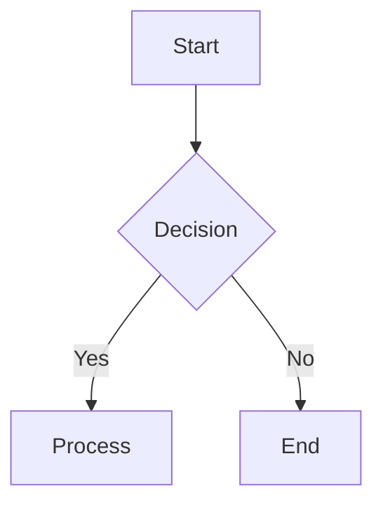
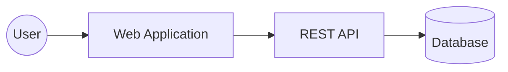
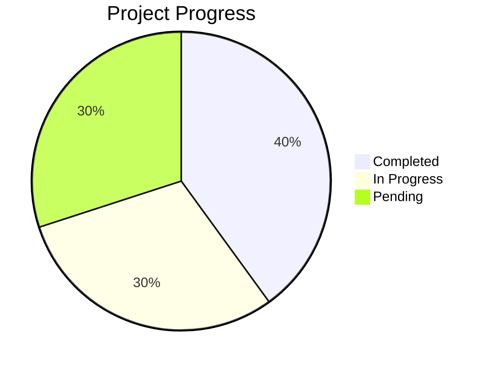

# Obsidian Documentation & Visualization Skill

This skill guides the creation of high-quality documentation and visual assets directly within an Obsidian vault.

## Workflows

### 1. Generating Changelogs
When creating a changelog, use the following structure in `Documentation/Changelogs/YYYY-MM-DD-vX.X.X.md`:
- **Date**: The release date.
- **Version**: Semantic versioning (e.g., 1.0.0).
- **Summary**: High-level overview.
- **Changes**: Categorized as `Added`, `Changed`, `Deprecated`, `Removed`, `Fixed`, or `Security`.

### 2. Creating Architectural Diagrams & Flow Maps
Obsidian supports **Mermaid.js**. Use code blocks tagged with `mermaid`.

#### Flowchart Example:

#### Architecture Diagram (C4 Lite) Example:

### 3. Creating Charts
For simple bar/line charts, use Mermaid's `pie` or `xychart-beta`. For complex data, suggest the "Obsidian Charts" plugin syntax.

#### Pie Chart Example:

## Resources
- **Mermaid Documentation**: Reference for syntax on Gantt charts, Sequence diagrams, and Class diagrams.
- **Obsidian Dataview**: Suggest using `dataview` blocks to aggregate changelogs automatically.

## Best Practices
- **Internal Linking**: Use `[[File Name]]` for linking between documents.
- **Frontmatter**: Always include `tags` and `created` date in the YAML frontmatter of new docs.
- **Visual Clarity**: Keep Mermaid diagrams focused; break complex systems into multiple smaller diagrams linked together.
