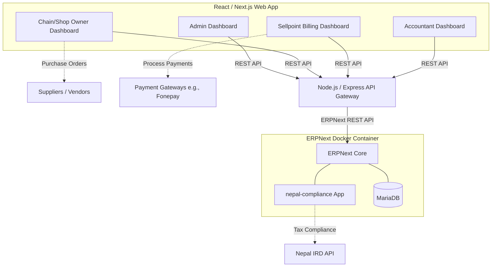

# System Context: Headless ERP Architecture

This diagram outlines the high-level architecture for the Sellpoint application, utilizing ERPNext as a headless backend engine to handle complex accounting and Nepal-specific compliance, while exposing a custom React frontend for the specific user dashboards.

## Key Decisions
- **ERPNext** is used strictly as a backend to bypass the need to rebuild double-entry accounting, 13% VAT, and IRD compliance.
- The **API Gateway** acts as a middle layer to format data specifically for the React dashboards, ensuring the frontend is decoupled from Frappe's specific data structures.
