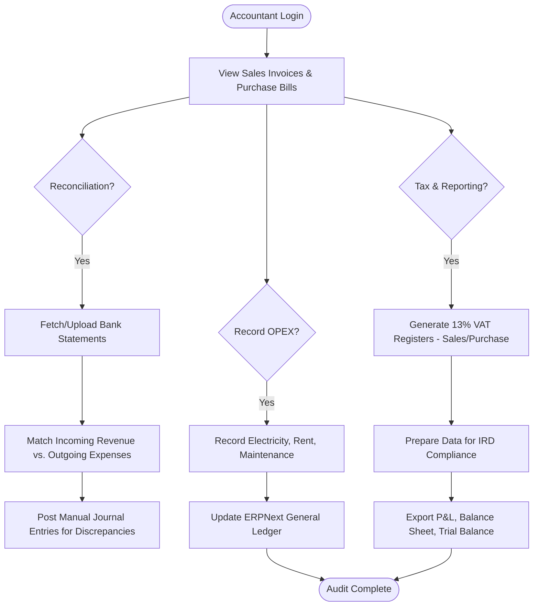

# Accountant: Compliance & Audit Flow

This flow maps the accountant's responsibility to ensure financial integrity and government compliance.

```mermaid
graph TD
    Start([Accountant Login]) --> DataReview[View Sales Invoices & Purchase Bills]
    
    DataReview --> Reconcile{Reconciliation?}
    Reconcile -- Yes --> BankStatement[Fetch/Upload Bank Statements]
    BankStatement --> Match[Match Incoming Revenue vs. Outgoing Expenses]
    Match --> JournalEntry[Post Manual Journal Entries for Discrepancies]
    
    DataReview --> ExpenseRecord{Record OPEX?}
    ExpenseRecord -- Yes --> LogExpense[Record Electricity, Rent, Maintenance]
    LogExpense --> UpdateLedger[Update ERPNext General Ledger]
    
    DataReview --> Compliance{Tax & Reporting?}
    Compliance -- Yes --> NepalTax[Generate 13% VAT Registers - Sales/Purchase]
    NepalTax --> IRDFiling[Prepare Data for IRD Compliance]
    IRDFiling --> Reports[Export P&L, Balance Sheet, Trial Balance]
    
    UpdateLedger --> End([Audit Complete])
    Reports --> End
```
