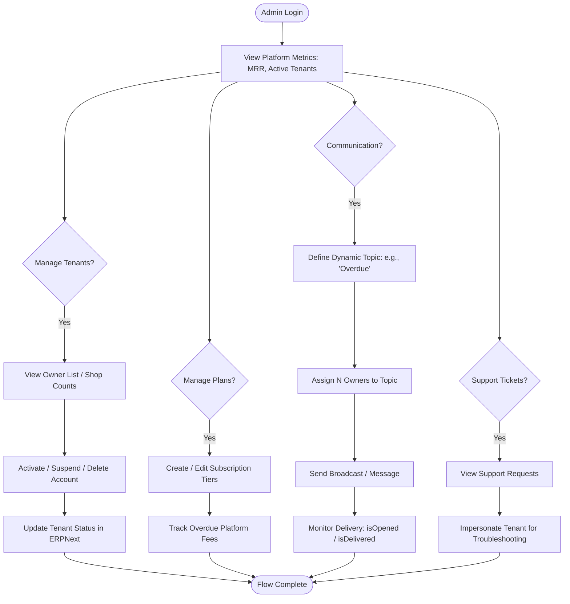

# Admin: SaaS Platform Flow

This flow covers the lifecycle of a SaaS tenant (Shop Owner) and platform-wide management from the Super Admin perspective.

```mermaid
graph TD
    Start([Admin Login]) --> Dashboard[View Platform Metrics: MRR, Active Tenants]
    
    Dashboard --> TenantManagement{Manage Tenants?}
    TenantManagement -- Yes --> TenantList[View Owner List / Shop Counts]
    TenantList --> TenantAction[Activate / Suspend / Delete Account]
    TenantAction --> SyncERP[Update Tenant Status in ERPNext]
    
    Dashboard --> SubsManagement{Manage Plans?}
    SubsManagement -- Yes --> DefinePlans[Create / Edit Subscription Tiers]
    DefinePlans --> MonitorBilling[Track Overdue Platform Fees]
    
    Dashboard --> CommHub{Communication?}
    CommHub -- Yes --> CreateTopic[Define Dynamic Topic: e.g., 'Overdue']
    CreateTopic --> SelectOwners[Assign N Owners to Topic]
    SelectOwners --> SendNotify[Send Broadcast / Message]
    SendNotify --> TrackStatus[Monitor Delivery: isOpened / isDelivered]
    
    Dashboard --> Support{Support Tickets?}
    Support -- Yes --> TicketInbox[View Support Requests]
    TicketInbox --> Impersonate[Impersonate Tenant for Troubleshooting]
    
    SyncERP --> End([Flow Complete])
    MonitorBilling --> End
    TrackStatus --> End
    Impersonate --> End
```
