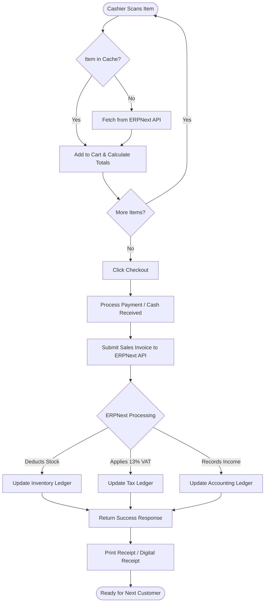

# Sellpoint Billing Flow

This flowchart maps the process of a cashier checking out a customer at the Sellpoint POS dashboard, emphasizing how it interacts with the headless ERPNext backend.
> [NOTE]
 This checkout logic is part of the high-level [Seller-Flow.md](./Seller-Flow.md).

