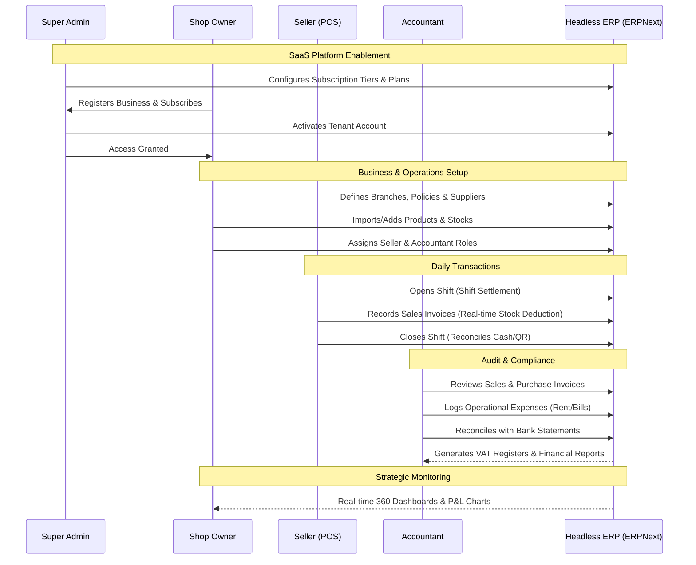

# Overall System Lifecycle Flow

This macro-flow illustrates how the four core personas interact through the centralized Headless ERP backend to maintain a functional POS and SaaS ecosystem.

```mermaid
sequenceDiagram
    participant A as Super Admin
    participant O as Shop Owner
    participant S as Seller (POS)
    participant AC as Accountant
    participant DB as Headless ERP (ERPNext)

    Note over A, DB: SaaS Platform Enablement
    A->>DB: Configures Subscription Tiers & Plans
    O->>A: Registers Business & Subscribes
    A->>DB: Activates Tenant Account
    A->>O: Access Granted

    Note over O, DB: Business & Operations Setup
    O->>DB: Defines Branches, Policies & Suppliers
    O->>DB: Imports/Adds Products & Stocks
    O->>DB: Assigns Seller & Accountant Roles

    Note over S, DB: Daily Transactions
    S->>DB: Opens Shift (Shift Settlement)
    S->>DB: Records Sales Invoices (Real-time Stock Deduction)
    S->>DB: Closes Shift (Reconciles Cash/QR)

    Note over AC, DB: Audit & Compliance
    AC->>DB: Reviews Sales & Purchase Invoices
    AC->>DB: Logs Operational Expenses (Rent/Bills)
    AC->>DB: Reconciles with Bank Statements
    DB-->>AC: Generates VAT Registers & Financial Reports

    Note over O, DB: Strategic Monitoring
    DB-->>O: Real-time 360 Dashboards & P&L Charts
```
