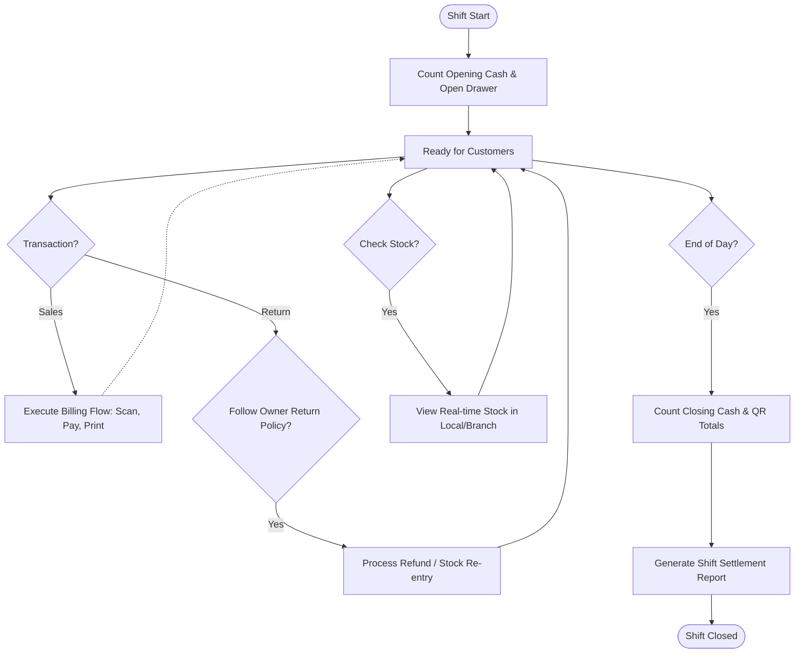

# Seller: POS & Shift Operations Flow

This flow covers the day-to-day operations of a seller/cashier, including shift management and customer service.

> [!NOTE]
> Detailed checkout process logic is documented in [Billing-Flow.md](./Billing-Flow.md).
