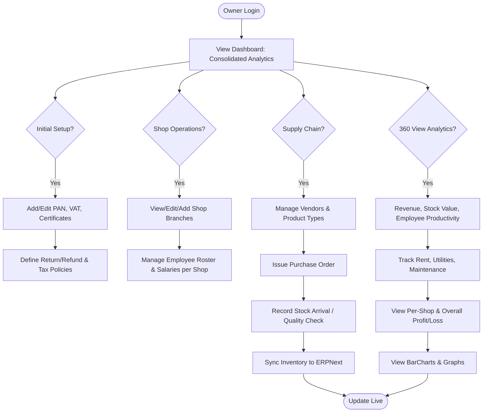

# Shop Owner: Business Management Flow

This flow maps how a business owner manages multiple shops, stock procurement, and monitors financial health.

```mermaid
graph TD
    Start([Owner Login]) --> MultiShop[View Dashboard: Consolidated Analytics]
    
    MultiShop --> Setup{Initial Setup?}
    Setup -- Yes --> BizInfo[Add/Edit PAN, VAT, Certificates]
    BizInfo --> PolicyDefine[Define Return/Refund & Tax Policies]
    
    MultiShop --> ShopOps{Shop Operations?}
    ShopOps -- Yes --> BranchManage[View/Edit/Add Shop Branches]
    BranchManage --> EmployeeAssign[Manage Employee Roster & Salaries per Shop]
    
    MultiShop --> SupplyChain{Supply Chain?}
    SupplyChain -- Yes --> SupplierManage[Manage Vendors & Product Types]
    SupplierManage --> CreatePO[Issue Purchase Order]
    CreatePO --> GoodsReceipt[Record Stock Arrival / Quality Check]
    GoodsReceipt --> StockUpdate[Sync Inventory to ERPNext]
    
    MultiShop --> Analytics{360 View Analytics?}
    Analytics -- Yes --> Metrics[Revenue, Stock Value, Employee Productivity]
    Metrics --> OPEX[Track Rent, Utilities, Maintenance]
    OPEX --> PnL[View Per-Shop & Overall Profit/Loss]
    
    StockUpdate --> End([Update Live])
    PnL --> Charts[View BarCharts & Graphs]
    Charts --> End
```
