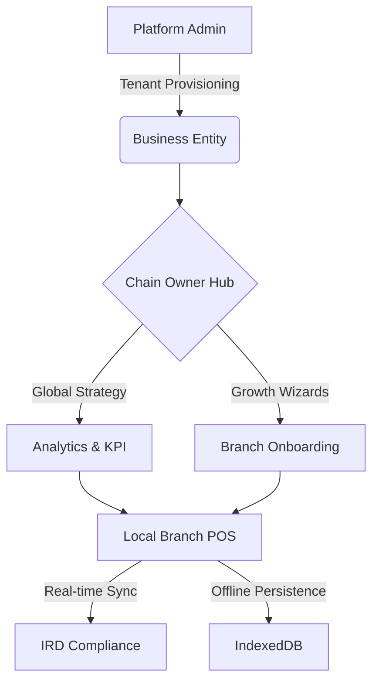

# 🛍️ Dukaan: Multi-Branch POS & Strategy Hub

      
> **The Single Source of Truth for Scalable Retail Operations.**

Dukaan is a high-performance, multi-branch POS and Chain Management SaaS platform designed to bridge the gap between local branch speed and global chain intelligence. It provides real-time visibility into financial health, inventory movement, and regulatory compliance (IRD).

---

## 🚀 Vision & Aesthetic
Dukaan embodies **Visual Sovereignty**. We transitioned from functional high-contrast to a premium `Slate-950` depth palette with `Emerald-500` accents, delivering a world-class SaaS experience without compromising on the zero-latency requirement of fast-paced retail environments.



---

## 🛠️ Key Capabilities

### 1. High-Performance POS HUD
- **Zero-Latency Grid:** Rapid item selection optimized for high-volume scanning.
- **60s Autonomous Void:** Cashiers can instantly correct mistakes within a 60-second window before manager intervention is required.
- **Split-Payment Engine:** Native support for Cash, Digital (QR/Fonepay), and Card payments.

### 2. Strategy Hub & Analytics
- **Executive Scorecard:** Real-time tracking of Revenue, Margin, and Transaction volume.
- **Operational Heatmap:** Instant visibility into branch health and stockout risks.
- **Compliance Sentinel:** Automated monitoring of IRD sync success and fraud detection (e.g., Discount Velocity flags).

### 3. Resilience & Compliance
- **Offline-First PWA:** Full billing capability during 100% internet outage using IndexedDB.
- **Background Sync:** Automated transaction upload once connectivity is restored.
- **IRD Sync Bridge:** Real-time generation of Annex 13/14 compliant payloads for the Nepalese tax system.

---

## 💻 Developer Guide

### Tech Stack
- **Backend:** Headless ERPNext (Frappe / MariaDB).
- **Frontend:** React + TypeScript + Vite.
- **Styling:** Tailwind CSS + Framer Motion.
- **Persistence:** IndexedDB (Client) + MariaDB (Server).

### Getting Started
```bash
# Clone the repository
git clone https://github.com/nayan/dukaan.git

# Frontend Setup
cd frontend
npm install
npm run dev

# Backend Setup (Requires Frappe Environment)
# Setup dukaan app in your bench
bench get-app dukaan
bench install-app dukaan
```

### Testing & QA
We maintain a strict **TDD-First** approach with >80% mandatory coverage.
```bash
# Frontend Tests
cd frontend
npm run test:coverage

# Backend Tests
pytest backend/dukaan/tests/
```

---

## 📖 Product Wiki & Manuals
- [User Guide](./docs/USER_GUIDE.md) - How to use the POS and Dashboard.
- [Onboarding Guide](./docs/GROWTH_WIZARD.md) - Scaling from single to multi-branch.
- [API Documentation](./docs/API.md) - Integrating with third-party services.
- [Design Tokens](./docs/DESIGN_SYSTEM.md) - Our visual sovereignty specification.

---

## ⚖️ License
Internal Proprietary Software - All Rights Reserved.
