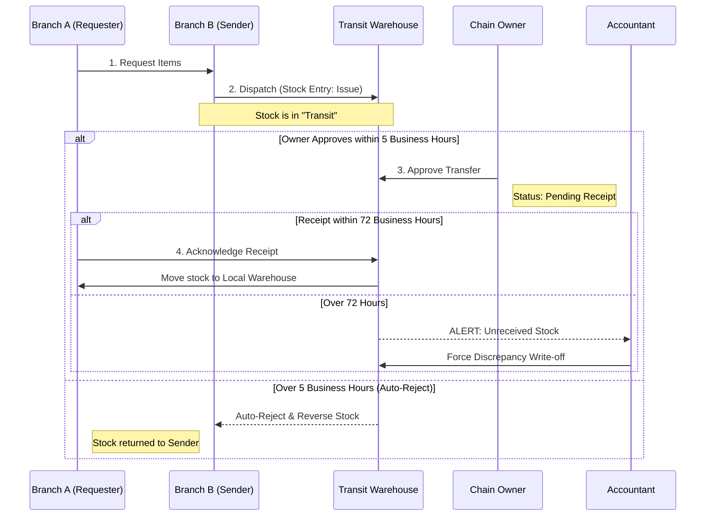

# Initial Concept
# Technical Specification: Multi-Branch & Chain Management System (Master Spec)

## 1. Executive Summary
This document serves as the **Single Source of Truth** for the transformation of the Sellpoint POS into a multi-branch chain system. It integrates technical architecture, persona-based UX design, operational workflows, and financial governance into one unified blueprint.

---

## 2. System Architecture & Permissions

### 2.1 Tech Stack
- **Backend:** Headless ERPNext (Frappe/MariaDB) as the master ledger.
- **Frontend:** React (TypeScript) Dashboard + POS.
- **Offline:** PWA with Service Workers and IndexedDB for local sales caching.
- **Communication:** Standard REST API + Custom whitelisted Frappe methods for wizard logic.

### 2.2 Permission Shadowing
To maintain high performance without compromising security:
1. **Login:** React fetches the full `User Permission` and `Role Profile` tree.
2. **Shadowing:** Permissions are stored in encrypted `sessionStorage` for instant UI updates (showing/hiding buttons).
3. **Hard Validation:** Every backend write/submit request performs a mandatory server-side check against the ERPNext source of truth.

---

## 3. Persona Matrix & UX Design

### 3.1 Dashboard UX & Guardrails

| Persona | Primary Focus | UI Components | Critical Guardrail |
| :--- | :--- | :--- | :--- |
| **Cashier** | Billing Speed | High-contrast "Speed Grid", Sidebar for recent receipts. | Blind to cost/margins; cannot void/delete. |
| **Branch Owner** | Local Ops | "Action Required" feed, Petty Cash modal, Spot-count tool. | Local discount capped at 5%; **Discount Velocity alerts enabled.** |
| **Chain Owner** | Global Strategy | Map-view of branch health, Global rankings, Wizards Hub. | Cannot receive stock at branch level (prevents ghost stock). |
| **Accountant** | Compliance | Reconciliation table, Month-Lock, IRD Vault (VAT). | Cannot create sales or change prices; Manages **Price Variance reports.** |
| **Super Admin** | Infrastructure | User provisioning, Server logs, Backup control. | No visibility into business P&L; all actions logged to Audit Log. |

---

## 4. Inventory & Supply Chain Intelligence

### 4.1 The 4-Step Inter-Branch Protocol
1. **Request:** Branch A initiates request via Item Picker.
2. **Dispatch:** Branch B moves stock to **Transit Warehouse**.
3. **Approval:** Chain Owner approves (Moves status to "Approved").
4. **Receipt:** Branch A acknowledges physical arrival.

### 4.2 Intelligence & Resilience Rules
- **Dead Stock Rebalancing:** System suggests transfers from branches with stagnant stock (>30 days).
- **Timeouts (Business Hours):** The 5-hour auto-rejection timer **pauses** during non-business hours (e.g., 6 PM to 9 AM) to prevent digital rejection while goods are physically in transit overnight.
- **72-Hour Receipt Alert:** If stock is not received within 72 business hours, an Auditor Alert is fired.

### 4.3 Flow: Inter-Branch Transfer

---

## 5. Financial & Marketing Governance

### 5.1 Purchasing Power & Returns
- **Budgeting:** Enforced via `Before Submit` hook on POs checking against a **Monthly Budget Limit**.
- **Cross-Branch Returns:** Cashiers can scan any invoice barcode to fetch a **Global Read-Only Verification**. If a return is processed in Branch B for an item bought in Branch A:
    - Branch B issues the refund.
    - System auto-generates an **Inter-Branch Financial Adjustment** (Debit A, Credit B).

### 5.2 Pricing & Campaigns
- **Price List Versioning:** All offline invoices are stamped with a `price_list_version` hash.
- **Offline Price Variance:** If a sale is synced with an outdated price (due to an outage during a global price update), the system accepts the invoice but flags it for **Accountant Review**.
- **Discount Velocity:** System monitors the frequency of "Quick Discounts." If a cashier uses max-discounts on >20% of cash sales, an automated **Fraud Alert** is sent to the Branch Owner.

---

## 6. Lifecycle Wizards

### 6.1 Single-to-Chain Transition
- **Automated Mapping:** Migrates stock from default to Branch 1 warehouse.
- **Compliance Lock:** Enters "Pending Verification" until IRD and Naming Series are confirmed.

### 6.2 Branch Dissolution (Handshake Protocol)
- Blocks closure until POS shifts are closed, stock is zeroed, and all "Cash-in-hand" is physically and digitally transferred to HO.

---

## 8. Compliance & Payment Integration

### 8.1 IRD (Inland Revenue Department) Compliance
- **CBMS Sync:** Real-time transmission of every "Submit" event to the IRD Central Billing Monitoring System.
- **Offline Buffer:** Invoices generated during internet outages are stored in a "Pending IRD Sync" queue. Upon reconnection, they are synced with the original `posting_date` and a `is_offline=1` flag.
- **Materialized VAT Register:** A read-only, high-performance table in MariaDB that generates Annex 13 (Sales) and Annex 14 (Purchase) registers instantly for the Accountant.
- **Integrity Check:** Daily automated checksum verification between source documents and materialized registers.
- **Immutability:** Once an invoice is synced to IRD, the "Amend" feature is locked. Errors must be corrected via **Credit Notes** (Sales Return).
- **Manual Force Sync:** Administrative trigger for Accountants to retry failed transmissions manually.

### 8.2 Payment Gateway & QR Logic
- **Fonepay/QR Integration:** POS generates a dynamic QR code containing the `Invoice ID` and `Grand Total`.
- **The "Verification Lock":** The POS `Finish Sale` button is disabled for digital payments until a **Server-Side Webhook** confirms the transaction.
- **Manual Override (Owner Only):** If the payment gateway is down but the customer shows proof, only a Branch Owner or Chain Owner can "Force Verify" a payment (logs the action for audit).
- **Split Payments:** UI supports "Cash + Digital" splits (e.g., NPR 500 Cash, NPR 1,200 eSewa).
- **Caching:** Item catalog and prices cached in **IndexedDB**.
- **Auto-Correction Sync:** If a sync fails (e.g., due to "Negative Stock" caused by a concurrent transfer), the invoice is moved to a **"Draft: Pending Resolution"** state rather than blocking the PWA queue.
- **Lockdown:** Inter-Branch Transfers and Price Changes are **strictly disabled** while offline.

### 7.2 Immutability & Audit
- **No Deletes:** "Delete" buttons are removed. Replaced by "Request Void" or "Amend."
- **High-Risk Flags:** Automated flags for voids made <5 mins after sale, visible only to HO.

---
